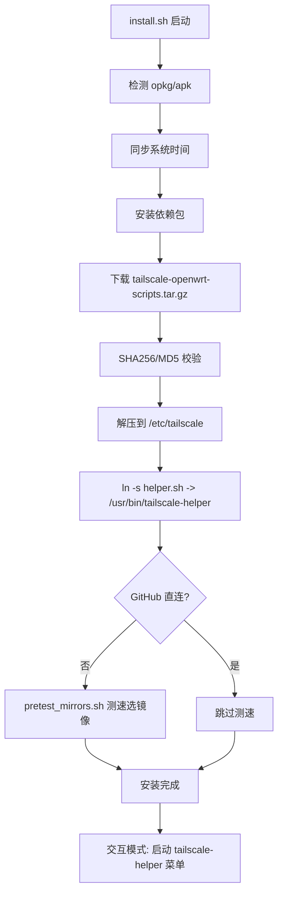

# luci-app-tailscale

面向 [small-tailscale-openwrt](https://github.com/CH3NGYZ/small-tailscale-openwrt)（Tailscale-Helper）的 LuCI 图形界面插件。

## 一键安装脚本工作原理

你执行的命令等价于：

```sh
rm -rf /etc/tailscale /tmp/install.sh
touch /tmp/tailscale-use-direct          # 标记：GitHub 直连，不走 gh.ch3ng.top 代理
curl/wget install.sh -> /tmp/install.sh
sh /tmp/install.sh
```

### 整体流程



### 阶段说明

| 阶段 | 作用 |
|------|------|
| **直连标记** | `/tmp/tailscale-use-direct` 存在时写 `GITHUB_DIRECT=true` 到 `/etc/tailscale/install.conf`，后续下载走 `github.com` 而非 `gh.ch3ng.top` |
| **包管理适配** | 同时支持 OpenWrt 的 `opkg` 与 ImmortalWrt 等的 `apk` |
| **时间同步** | 先 NTP，失败则用 HTTP Date 头校时，避免 TLS 证书因时钟错误失败 |
| **依赖安装** | `ca-bundle`、`kmod-tun`、`curl`、`coreutils-timeout/nohup` 等 |
| **脚本包** | 下载 `tailscale-openwrt-scripts.tar.gz`，校验后解压到 `/etc/tailscale/` |
| **镜像测速** | 非直连模式下运行 `pretest_mirrors.sh`，生成 `/etc/tailscale/proxies.txt` |

### `/etc/tailscale/` 核心脚本

| 文件 | 功能 |
|------|------|
| `tools.sh` | 公共库：架构探测、GitHub 代理切换、`webget` 下载、日志 |
| `helper.sh` | 交互菜单：安装/登录/登出/更新/通知等 14 项功能 |
| `setup.sh` | 安装向导：选择本地/内存模式、版本、是否自动更新 |
| `fetch_and_install.sh` | 从 GitHub Release 下载 `tailscaled-linux-$arch` 并安装 |
| `setup_service.sh` | 生成 `/etc/init.d/tailscale`（procd 管理 tailscaled） |
| `setup_cron.sh` | 配置自动更新 cron |
| `autoupdate.sh` | 检查并更新 tailscaled 二进制 |
| `tailscale_up_generator.sh` | 生成带参数的 `tailscale up` 命令 |

### Tailscale 二进制安装方式

`fetch_and_install.sh` 从 [CH3NGYZ/small-tailscale-openwrt Releases](https://github.com/CH3NGYZ/small-tailscale-openwrt/releases) 下载预编译的 `tailscaled-linux-$arch`：

- **本地模式 (local)**：`/usr/local/bin/tailscaled`，软链到 `/usr/bin/tailscale`
- **内存模式 (tmp)**：`/tmp/tailscaled`（重启丢失，启动时重新下载）

状态文件：`/etc/config/tailscaled.state`  
服务端口：`41641`

### 与官方 opkg tailscale 的区别

| 项目 | Tailscale-Helper | 官方 opkg |
|------|------------------|-----------|
| 二进制来源 | GitHub Release 小型化构建 | OpenWrt feeds |
| 配置 | `/etc/tailscale/install.conf` | `/etc/config/tailscale` |
| 管理入口 | `tailscale-helper` CLI 菜单 | `tailscale` + 可选 LuCI |
| 镜像加速 | 内置 gh.ch3ng.top 代理池 | 无 |

---

## 开发环境

### 目录结构

```
luci-app-tailscale/
├── Makefile
├── htdocs/luci-static/resources/view/tailscale/overview.js
├── root/
│   ├── etc/config/tailscale
│   └── usr/share/
│       ├── luci/menu.d/luci-app-tailscale.json
│       └── rpcd/
│           ├── acl.d/luci-app-tailscale.json
│           └── ucode/tailscale.uc
├── po/zh_Hans/tailscale.po
├── scripts/
│   ├── dev-setup.sh          # Linux 下下载 SDK 并链接本包
│   └── deploy-to-router.sh   # 热部署到路由器（推荐 macOS 开发）
└── .reference/               # 参考项目（已 gitignore）
```

### 方式一：路由器热部署（macOS 推荐）

无需编译，改完代码直接同步到路由器：

```sh
chmod +x scripts/deploy-to-router.sh
./scripts/deploy-to-router.sh root@192.168.1.1
```

LuCI 路径：**VPN → Tailscale**

### 方式二：OpenWrt SDK 编译 ipk（Linux）

```sh
chmod +x scripts/dev-setup.sh
OPENWRT_VERSION=24.10.3 TARGET_PATH=x86/64 ./scripts/dev-setup.sh

cd openwrt-sdk
make menuconfig   # LuCI -> Applications -> luci-app-tailscale
make package/luci-app-tailscale/compile V=s

# 安装到路由器
scp bin/packages/*/luci/luci-app-tailscale_*.ipk root@192.168.1.1:/tmp/
ssh root@192.168.1.1 "opkg install --force-overwrite /tmp/luci-app-tailscale_*.ipk"
```

### 方式三：GitHub Actions

可参考 `.reference/luci-app-tailscale-community/.github/workflows/build.yml` 配置 CI 自动编译。

---

## 当前插件能力

### 页面结构

1. **状态区**
   - **总开关**：控制 `/etc/init.d/tailscale` 启停
   - **运行状态**：Running / Stopped / Needs Login
   - **登录状态**：Logged In / Needs Login 等
   - **登录 / 登出** 按钮

2. **安装 / 重装**（等价于 helper 菜单 1）
   - 安装模式、版本、自动更新、GitHub 直连
   - 点击安装后调用 `/etc/tailscale/luci-install.sh`

3. **连接设置**（等价于 helper 菜单 3）
   - 配置 `tailscale up` 参数，保存到 `/etc/tailscale/tailscale_up.conf`
   - 支持「保存并应用」直接执行 `tailscale up`

### 文件路径（页面上有展示）

| 用途 | 路径 |
|------|------|
| 二进制（本地模式） | `/usr/local/bin/tailscaled` |
| 二进制（内存模式） | `/tmp/tailscaled` |
| CLI 软链接 | `/usr/bin/tailscale` |
| 安装配置 | `/etc/tailscale/install.conf` |
| tailscale up 配置 | `/etc/tailscale/tailscale_up.conf` |
| 守护进程状态 | `/etc/config/tailscaled.state` |
| 版本记录 | `/etc/tailscale/current_version` |
| 启动脚本 | `/etc/init.d/tailscale` |
| LuCI UCI | `/etc/config/tailscale` |

## 后续可扩展

- 对接 `setup.sh` 的安装/重装流程
- 自动更新开关（读写 `install.conf` + `update_ctl.sh`）
- `tailscale up` 高级参数（subnet router、exit node 等）
- 日志查看、镜像测速结果展示

## 参考

- [CH3NGYZ/small-tailscale-openwrt](https://github.com/CH3NGYZ/small-tailscale-openwrt)
- [Tokisaki-Galaxy/luci-app-tailscale-community](https://github.com/Tokisaki-Galaxy/luci-app-tailscale-community)（官方 LuCI 已合并社区版）
